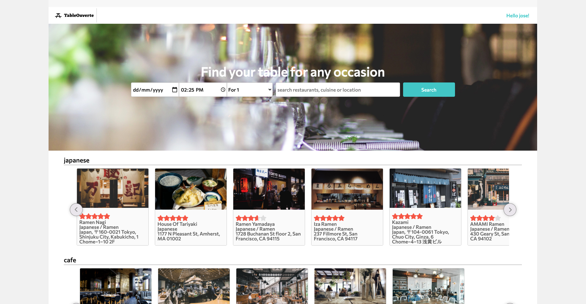

# README

## Welcome to Table Ouverte

Table Ouverte is a clone project of OpenTable

[visit Table Ouverte:](https://tableouverte.herokuapp.com)

* Users are able to create an account or log in by using the navbar at the top of the page.
the nav bar holds a dropdown that appears when a user is logged in, a user can currently access their restaurants and profile from this navbar 

* on the main page all users have access to the restaurant search bar, 
    this component uses loaction date and number of people to help users find a table that will match their request.
    
* also on the main page users can find restaurant via carousel of restaurants
    

* Users can reserve tables regardless of if they have a Table Ouverte account,
however users will not be able to create restaurants or view previous reservations if they are not a member, and they will not be able to leave reviews
        

* Logged in users can leave a review on any restaurant.
    
* on the user profile page all users are able to see a list of the restaurants that they own and also a form that will allow them to create a new restaurant
        

upcoming features:

  *  google api:
        *users will be able to find the exact location of the restaurant they would like to visit
 

